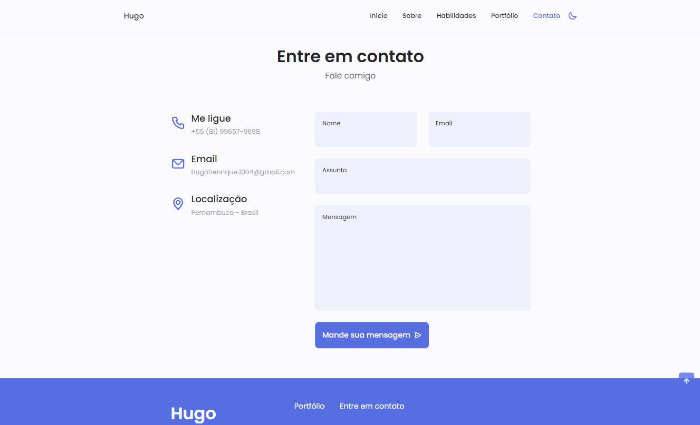

# Portfolio Pessoal

## Sobre o Projeto

Este é o código-fonte do meu portfolio pessoal, uma aplicação web que apresenta minhas habilidades, projetos e informações relevantes sobre minha carreira e experiência. O projeto foi desenvolvido para fornecer uma visão abrangente sobre quem eu sou, minhas habilidades técnicas e projetos anteriores.

## Recursos

- **Menu Navegável:** Navegue facilmente por diferentes seções do portfolio.
- **Exibição de Habilidades:** Utiliza um acordeão para exibir e ocultar detalhes sobre minhas habilidades.
- **Swiper para Portfólio:** Implementa um carrossel de projetos usando a biblioteca Swiper.
- **Destaque de Seção Ativa:** Destaca automaticamente a seção ativa no menu de navegação conforme você rola pela página.
- **Modo Escuro:** Oferece suporte a um modo escuro para melhorar a experiência de visualização.

## Demonstração





## Tecnologias Utilizadas

- HTML
- CSS (com pré-processador)
- JavaScript (Vanilla)
- Swiper.js (para o carrossel do portfólio)

## Como Iniciar

1. **Clone o Repositório:**
   ```sh
   git clone https://github.com/seu-username/seu-portfolio.git
   cd seu-portfolio

2. **Abra o projeto:
- Abra o arquivo `index.html` no seu navegador de escolha

## Contribuições

Contribuições são bem-vindas! Sinta-se à vontade para abrir issues ou pull requests.

## Contanto

- Nome: Hugo Henrique
- Email: hugohenrique.1004@gmail.com
- Linkedin: https://www.linkedin.com/in/hwgohenrique/